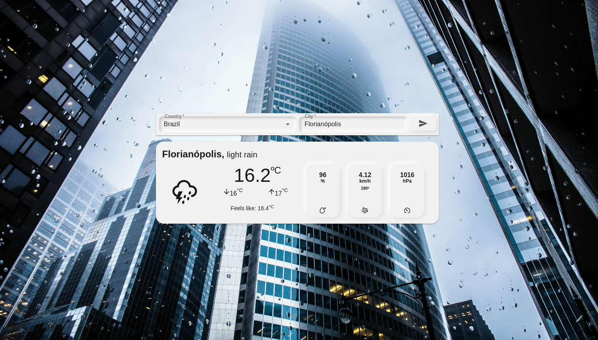

# Weather App

This is a React App that shows the weather for a chosen location. The application design is inspired in neumorphism and there are some animated raindrops on the background image (only for desktop due to the used library).

Check an screenshot below:



Demo: https://renantkn-weather.vercel.app/

## How to run locally

```bash
yarn install

yarn start

# or if you prefer npm

npm install

npm start
```

## Technologies used

- [React](https://reactjs.org/)
- [TypeScript](https://www.typescriptlang.org/)
- [Material UI](https://mui.com/)
- [Axios](https://axios-http.com/)
- [Formik](https://formik.org)
- [RainyDay.js](https://mubaidr.js.org/rainyday.js/)

## API

- [OpenWeather](https://openweathermap.org/)
